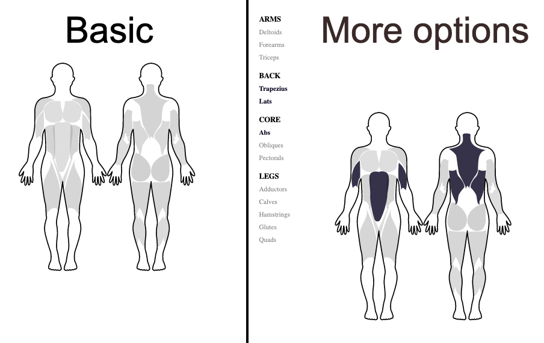

# Vue Muscle Group Selector

Wrapper for Vue3 with super powers of [muscle group selector](https://codepen.io/baublet/pen/PzjmpL) made by [Ryan M. Poe](https://www.ryanmpoe.com/).

---



---

## Get started

Install

```bash
npm install vue-muscle-group-selector
# or 
yarn add vue-muscle-group-selector
```

## Usage

```html
<script setup>
import VueMuscleGroupSelector from "vue-muscle-group-selector";
import "vue-muscle-group-selector/dist/style.css";

const handleOnSelectMuscularGroup = selection => {
  console.log(selection) // array of selection e.g ['abs']
}
</script>

<template>
  <div>
    <muscle-group-selector
      :translations="muscularGroupTranslations"
      @on-select="handleOnSelectMuscularGroup"
    />
  </div>
</template>

```

## Props

**allowMultiple**`[BOOLEAN]`: If true, the user can select multiple muscle groups, if false, the user can only select one muscle group.

**primaryColor** `[STRING]`: The primary color of the component, this is the color of the selected muscle groups.

**initialValues** `[ARRAY]`:  Array of muscle groups to be selected by default, this is the ID of the muscle group, not the name.

**showMusclesListHelper** `[BOOLEAN]`: If true, the helper list of the muscle groups will be shown, if false, the helper list will be hidden.

**showBackMuscles** `[BOOLEAN]`: If true, the legs muscle groups will be shown, if false, the legs muscle groups will be hidden.

**showFrontMuscles** `[BOOLEAN]`: If true, the back muscle groups will be shown, if false, the back muscle groups will be hidden.

**translations** `[OBJECT]`: The translations of the muscle groups, the keys are the IDs of the muscle groups, the values are the names of the muscle groups.

## Events

**onSelect**: This event is dispatched when the user selects any muscular group and returns an array of the selection.

## Give a Star! ⭐

If you like this project or plan to use it in the future, please give it a star. Thanks 🙏

## Bugs and Feedback

For bugs, questions, and discussions, please use the [Github Issues](https://github.com/itsalb3rt/vue-muscle-group-selector/issues) we have cool templates for you.

## Contributing

For contributing, please see the following links:

 - [Contribution Documents](https://github.com/itsalb3rt/vue-muscle-group-selector/blob/master/CONTRIBUTING.md)

We're glad to be supported by respected companies and individuals from several industries. [See our Github Sponsors learn more](https://github.com/sponsors/itsalb3rt).

**Sponsors**


> [Become a Github Sponsor](https://github.com/sponsors/itsalb3rt)

---

## Authors
  - Original author - [Ryan M. Poe](https://www.ryanmpoe.com/)
 - Vue 3 Wrapper - [Albert Hidalgo](https://github.com/itsalb3rt)

## License
MIT License (see [LICENSE](https://github.com/itsalb3rt/vue-muscle-group-selector/blob/master/LICENSE) for details).